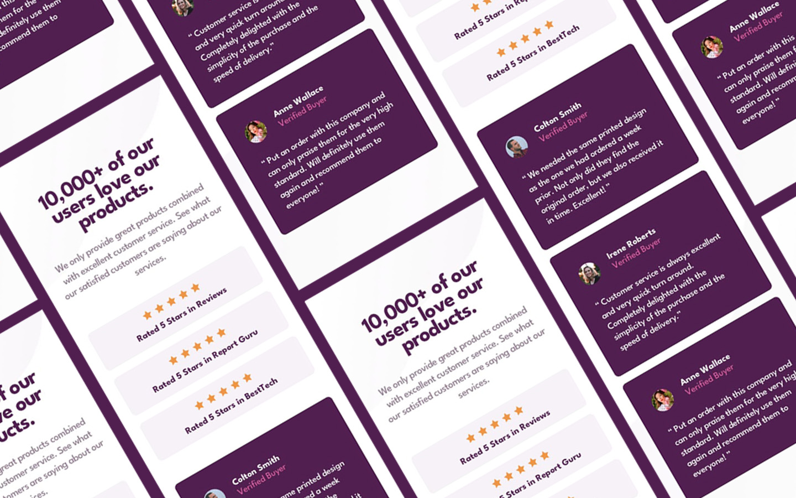

# Frontend Mentor - NFT preview card component solution





This is a solution to the [QR code component challenge on Frontend Mentor](https://www.frontendmentor.io/challenges/).

## Table of contents

- [Overview](#overview)
  - [Links](#links)
- [My process and what I learned](#my-process-and-what-i-learned)
  - [Built with](#built-with)
  - [Continued development and resources](#continued-development-and-resources)
  - [What I learned](#what-i-learned)
- [Author](#author)


## Overview

### Links

- XD Prototype: [https://xd.adobe.com/view/946db29a-14f3-49f9-9b34-32652853ade9-c13e/](https://xd.adobe.com/view/946db29a-14f3-49f9-9b34-32652853ade9-c13e/)
- Solution URL: []()
- Live Site URL: [https://codedavidc.github.io/four-card-feature-section-master/](https://codedavidc.github.io/four-card-feature-section-master/)


## My process and what I learned

I created an XD File before coding to create a prototype of the design.

I practiced how to use CSS Grid and positioning elements with start, center and end. I also practiced animations.


### Built with

- HTML and CSS
- Some BEM CSS class naming convention
- CSS Flexbox
- Mobile-first workflow


### What I learned

I learned how to use these lines of code:

```html

```
```css

```


### Continued development and resources

I want to have a faster workflow.

- [W3 Schools: Multiple Background Images](https://www.w3schools.com/css/css3_backgrounds.asp) - This helped me with adding multiple images in the background and positioning them - even the shorthand background.


## Author

I'm a Creative Professional working with Motion, Web, and Graphic Design. 
Learn more about my me and my work below! 😀

- Website - [designsdavidc.com](https://www.designsdavidc.com)
- LinkedIn - [davidChavezDesign](https://www.linkedin.com/in/davidchavezdesign/)
- Frontend Mentor - [@codeDavidC](https://www.frontendmentor.io/profile/codeDavidC)
- Instagram - [@designsDavidC](https://www.instagram.com/designsdavidc/)
- Behance - [davidchavez2020](https://www.behance.net/davidchavez2020)
